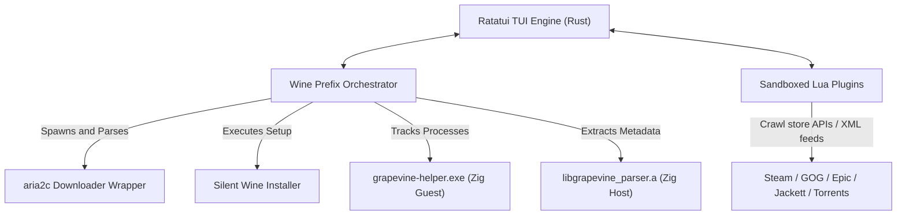

# 🍇 GrapeWine

[](#)
[](https://www.rust-lang.org)
[](https://ziglang.org)
[](#)

**GrapeWine** is an open-source, terminal-based Wine prefix orchestrator and game launcher for Linux. Written in Rust, Zig, and Lua, it is designed for gamers who want a sleek, lightweight, and keyboard-driven interface to catalog, download, install, and run games from multiple storefronts and custom torrent feeds.

---

## ✨ Features

- **🎮 Gorgeous TUI Dashboard**: Built with [Ratatui](https://github.com/ratatui-org/ratatui) using a premium dark-mode aesthetic with custom sidebar views, grid layout tables, running state modals, and interactive details panel.
- **📥 Hands-Free Torrent Installer**: Integrates background downloads (`aria2c`) and handles archive extraction (`zip/tar/xz`) or silent setup execution (`/VERYSILENT`, `/S` installers in Wine) automatically without human intervention.
- **🔍 Smart Executable Scanner**: Walks the Wine prefix virtual `drive_c/` recursively, filters out standard uninstaller/redistributables, sorts by size, and auto-configures the main game executable.
- **⚙️ Wine Prefix Orchestration**: Separates game runtimes into sandboxed prefix environments, monitors Wine runner processes, and applies custom configurations (DXVK DLL overrides, MangoHud overlays, and GameMode integration).
- **⏱️ Playtime Tracking**: Employs a custom Zig guest helper (`grapevine-helper.exe`) running inside the Wine environment. It utilizes the Windows Job Objects API to accurately log game execution and elapsed playtime directly back to the host filesystem.
- **🔌 Lua Plugin System**: Write custom source parsers (e.g. Steam, Epic, GOG, Jackett Torznab feeds) run inside a sandboxed Lua host runtime that strips out unsafe native functions and injects safe network/fs bindings.

---

## 🛠️ Monorepo Architecture



* **`core/` (Rust)**: Manages terminal hooks, Sandboxed Lua host engine, TUI loops, background download channels, and Wine runner orchestration.
* **`parser/` (Zig)**: A high-performance native library linking statically into the Rust core. Parses Portable Executable (PE) headers, resolves architecture, and walks resource trees to extract icon directories.
* **`helper-windows/` (Zig)**: A guest application cross-compiled for Windows. It acts as an active process watchdog in the Wine prefix using Job Objects to track playtime.
* **`plugins/` (Lua)**: Dynamic plugins that fetch game info from digital storefronts or Torznab search indexers.

---

## 🚀 Getting Started

### 📋 Prerequisites

To compile and execute GrapeWine, ensure the following utilities are installed on your host system:
* **Rust/Cargo** (Rust Edition 2024)
* **Zig Compiler** (>= 0.13.0)
* **aria2** (Required for torrent downloads, e.g., `sudo apt install aria2` or `sudo pacman -S aria2`)
* **wine** (System Wine runner)

### ⬇️ Installation

Run the universal installer script to download, compile, and configure the launcher symlinks:
```bash
curl -sSf https://raw.githubusercontent.com/g-varhan/GrapeWine/main/install.sh | bash
```

This compiles GrapeWine and adds binary executables to `~/.local/bin/`. You can now run the game launcher from anywhere in your terminal by typing:
```bash
grape
# or
grapewine
```

---

## 🔍 Sourcing and Search Configurations

### Curated Database
GrapeWine comes out of the box with a pre-configured database of legal and open-source game torrents (such as *SuperTuxKart*, *OpenTTD*, and *Freedoom*).

### Jackett / Prowlarr Integration
To enable automated searches across custom trackers, configure your Jackett/Prowlarr endpoints:
1. Open your GrapeWine cache database at `~/.local/share/grapevine/cache.json`.
2. Add your server url and api key:
   ```json
   {
     "jackett_url": "http://localhost:9117",
     "jackett_api_key": "YOUR_PERSONAL_JACKETT_API_KEY"
   }
   ```
3. Queries in the **Search Sources** tab will now automatically crawl your indexers, download game torrents, silently run setups in Wine, scan for the main `.exe`, and launch the game hands-free!

---

## 🗑️ Uninstallation

To remove GrapeWine executables, simply execute the installer with the `--uninstall` flag:
```bash
grapewine --uninstall
```
You will be prompted whether you want to preserve or delete your Wine prefixes, database, and playtime logs located at `~/.local/share/grapevine`.
